# Project Documentation

## Table of Contents
- [Team Information](#team-information)
- [Meeting Minutes](#meeting-minutes)
  - [Meeting – Feb 21, 2026](#meeting--feb-21-2026)
  - [Meeting – Mar 1, 2026](#meeting--mar-1-2026)
  - [Meeting – Mar 7, 2026](#meeting--mar-7-2026)
  - [Meeting – TBD](#meeting--tbd)

- [UML Diagrams](#uml-diagrams)
- [CRC Diagrams](#crc-diagrams)
- [StoryBoards](#StoryBoards)

- [Product Backlog](#product-backlog)
  - [Product Backlog – Project Part 1](#product-backlog--project-part-1)
  - [Product Backlog – Project Part 2](#product-backlog--project-part-2)
  - [Product Backlog – Project Part 3](#product-backlog--project-part-3)

- [Wireframes](#wireframes)
  - [Wireframes – Project Part 1](#wireframes--project-part-1)
  - [Wireframes – Project Part 2](#wireframes--project-part-2)
  - [Wireframes – Project Part 3](#wireframes--project-part-3)

---

## Team Information
- **Team Name:** turtle

| Name               | Roll Number | GitHub ID |
|--------------------|-------------|-----------|
| Dua Tariq          | 27100364    |DuaTariq364|
| Maha Shabbir       | 27100288    |m-shab     |
| Sehrish Habib      | 27100313    |sehrish-11 |
| Esha Ashar         | 27100080    |esha1111   |
| Shanzay Saleem     | 27100113    |Shanzay2000|

---

## Meeting Minutes

### Meeting – Feb 21, 2026

#### Date
Saturday, February 21, 2026

#### Attendance
- Dua
- Sehrish
- Maha
- Esha
- Shanzay

---

#### Key Takeaways
- Add contributors + make repo private
- Make wiki home page with all members (rollnumbers + github username)
- Make meetings wiki pages and make sure to document meeting minutes in every meeting from now on
- Make product backlog wiki page
- Make storyboard demonstrating app pages etc.

#### Prepared Questions & Decisions

**No major issues**

#### General Notes

---

#### Action Items
- [ ] Creating home page with team info 
- [ ] Maintain meeting minutes for every meeting

---

### Meeting – Mar 1st, 2026

#### Date
Sunday, March 1, 2026

#### Attendance
- Dua
- Sehrish
- Maha
- Esha
- Shanzay

---

#### Key Takeaways
- Got previous work reviewed
- Discussed ideas for user stories
- Got briefing on Storyboards & CRC

#### Prepared Questions & Decisions

**No major issues**

#### General Notes

---

#### Action Items
- [ ] Get started on user stories, storyboard, and CRC cards

---

### Meeting – Mar 7th, 2026

#### Date
Sunday, March 7, 2026

#### Attendance
- Dua
- Sehrish
- Maha
- Esha
- Shanzay

---

#### Key Takeaways
- Finalized User Stories
- Finalized Storyboards
- Got some questions cleared for CRC diagrams - to be done by Sunday/Monday

#### Prepared Questions & Decisions

**No major issues**

#### General Notes

---

#### Action Items
- [ ] Finalize storyboards
- [ ] Create CRC diagrams

---

### Meeting – TBD
_Content to be added._

---

## UML Diagrams
_Add UML diagrams here or link images from the repository._

---

---

## CRC Diagrams
_CRC Tables_

---

## StoryBoards

  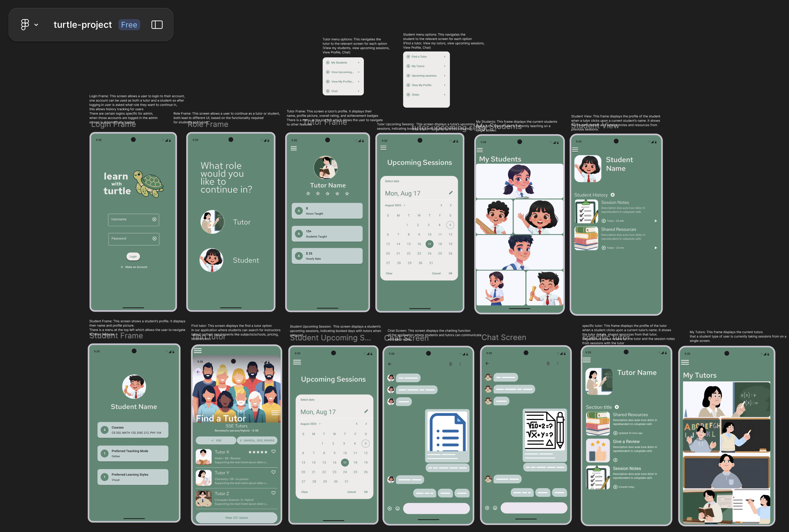
  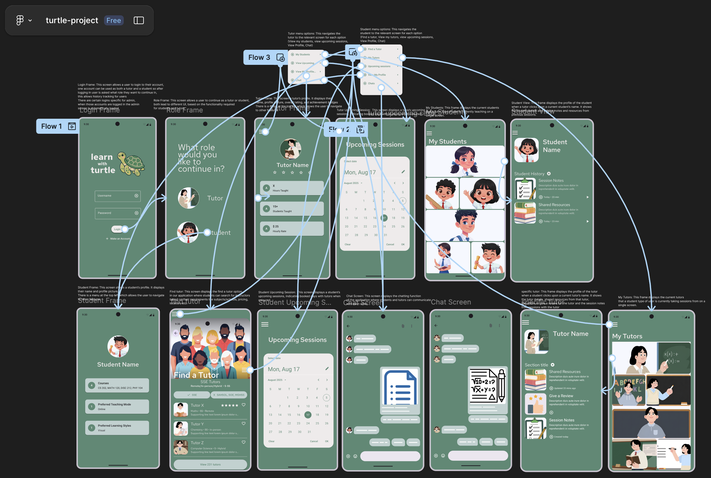

## Application Flow

  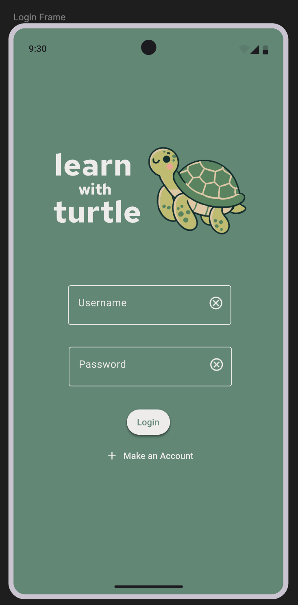
  

  <b>Login</b> → <b>Roles</b>

Login Frame: This screen allows a user to login to their account, 
one account can be used as both a tutor and a student so after 
logging in user is asked what role they want to continue in, 
this allows history tracking for users
There are certain logins specific for admin, 
when those accounts are logged in the admin 
screen is automatically loaded

Role Frame: This screen allows a user to continue as a tutor or student, 
both lead to different UI, based on the functionality required 
for students and tutors

## Tutor Flow

  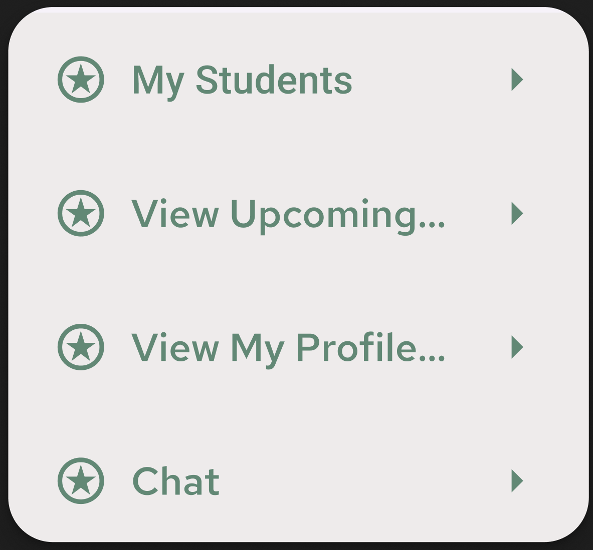
  
  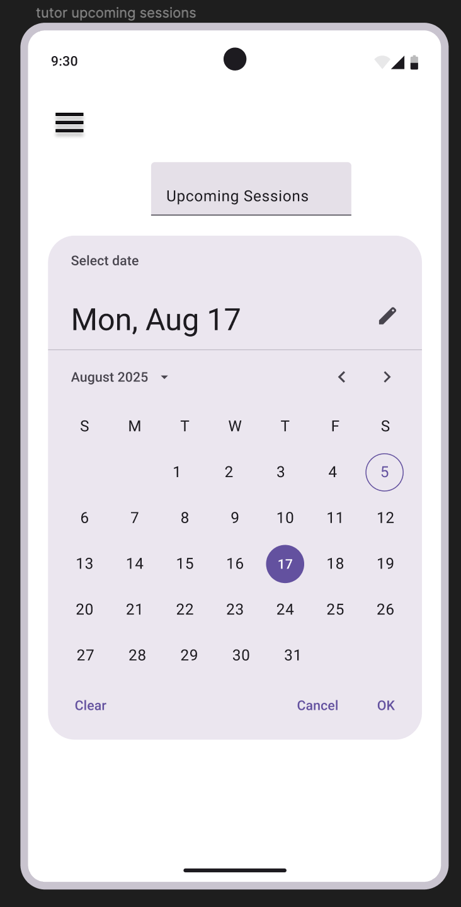
  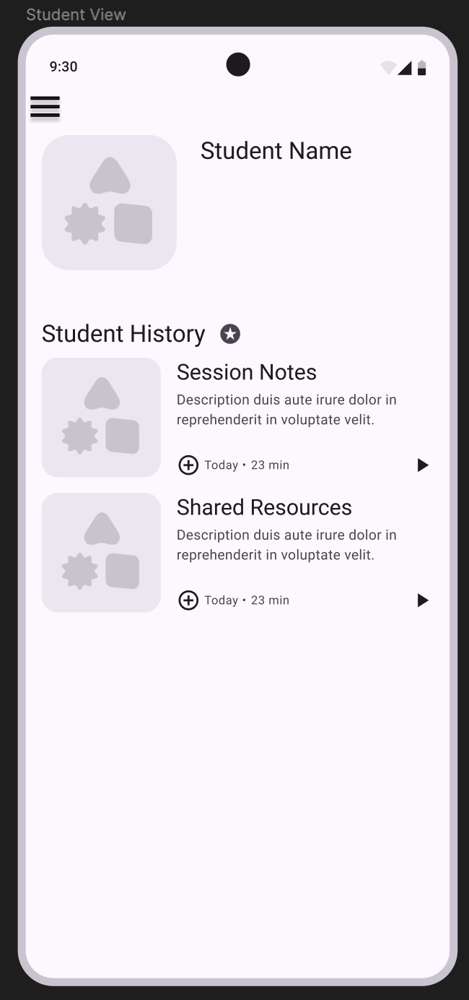
  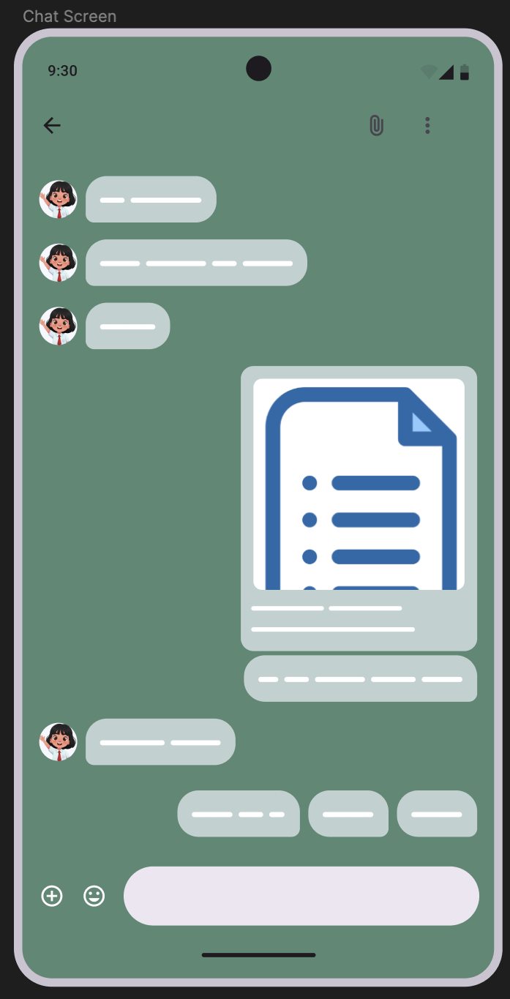

  <b>Tutor Profile</b> → <b>Tutor Upcoming Sessions</b> → <b>My Students</b> → <b>Chat</b> 
  <b>Tutor Profile</b> → <b>My Students</b> → <b>Chat</b> → <b>Tutor Upcoming Sessions</b> 
  <b>Tutor Profile</b> → <b>Chat</b> → <b>My Students</b> → <b>Tutor Upcoming Sessions</b>

Tutor menu options: This navigates the tutor to the relevant screen for 
each option (View my students, view upcoming sessions, 
View Profile, Chat).

Tutor Frame: This screen a tutor’s profile. It displays their 
name, profile picture, overall rating, and achievement badges
There is a menu at the top left which allows the user to navigate 
to other features

Tutor Upcoming Session:  This screen displays a tutor’s upcoming
sessions, indicating booked days with students when coloured.

Student View: This frame displays the profile of the student
when a tutor clicks upon a current student’s name. It shows 
the student details and session notes and resources from
previous sessions.

My Students: This frame displays the current students
that a tutor type of user is currently teaching on a 
single screen.

Chat Screen: This screen displays the chatting function
of the application where students and tutors can communicate
with each other.

## Student Flow

  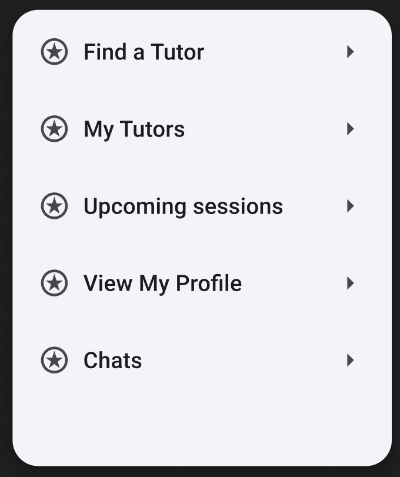
  
  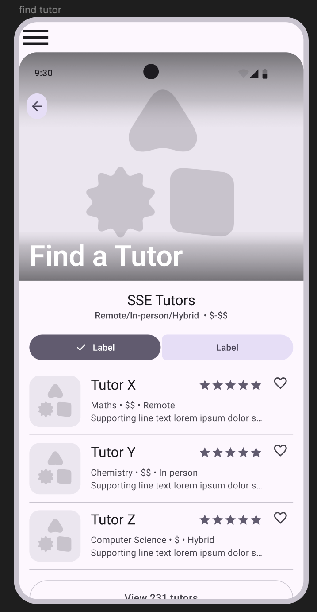
  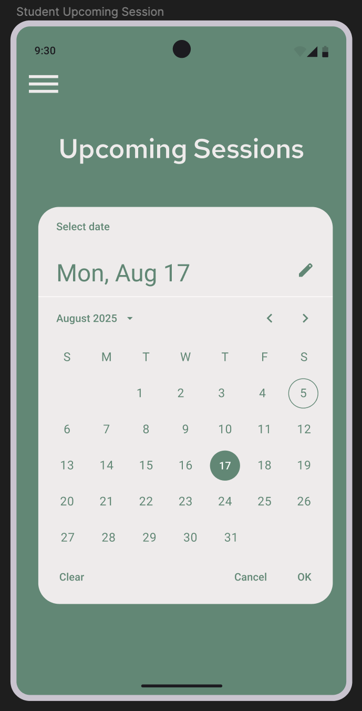
  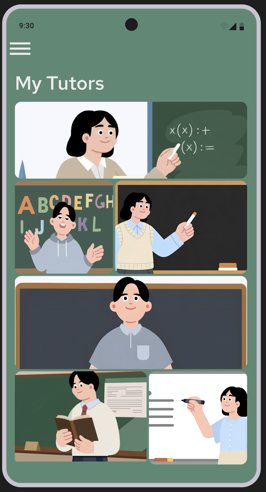
  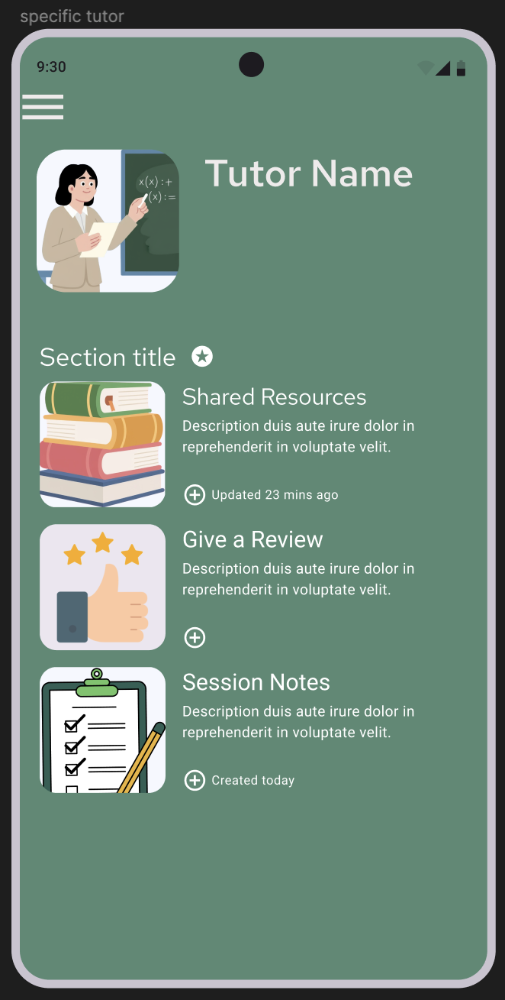
  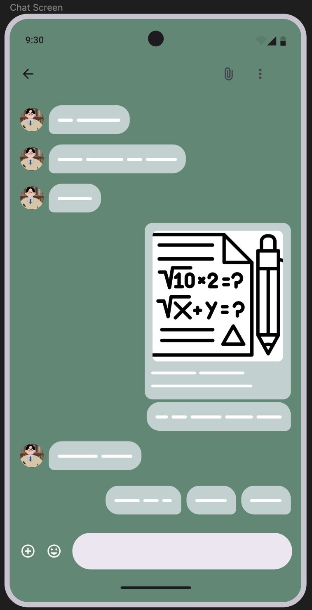

  <b>Student Profile</b> → <b>Find a Tutor</b> → <b>My Upcoming Sessions</b> → <b>My Tutors</b>  → <b>My Tutor History</b>  → <b>Chat</b> 
  <b>Student Profile</b> → <b>My Upcoming Sessions</b> → <b>Chat</b> → <b>Find a Tutor</b> → <b>My Tutors</b> → <b>My Tutor History</b> 
  <b>Student Profile</b> → <b>My Tutors</b> → <b>Find a Tutor</b> → <b>Chat</b> → <b>My Upcoming Sessions</b> → <b>My Tutor History</b>

Student menu options: This navigates the 
student to the relevant screen for each option
(Find a tutor, View my tutors, view upcoming sessions, 
View Profile, Chat).

Student Frame: This screen shows a student’s profile. It displays 
their name and profile picture.
There is a menu at the top left which allows the user to navigate 
to other features.

Find tutor: This screen displays the find a tutor option
in our application where students can search for instructors
based on their requirements like subjects/schools, pricing, 
location, etc.  

Student Upcoming Session:  This screen displays a student’s 
upcoming sessions, indicating booked days with tutors when 
coloured.

My Tutors: This frame displays the current tutors
that a student type of user is currently taking sessions from on a 
single screen.

Single Tutor History: This frame displays the profile of the tutor
when a student clicks upon a current tutor’s name. It shows 
the tutor details, shared resources from that tutor, 
the option to give a review for the tutor and the session notes 
from sessions with the tutor.

Chat Screen: This screen displays the chatting function
of the application where students and tutors can communicate
with each other.

---

## Product Backlog

### Product Backlog – Project Part 1

| ID | User Story | Priority | Status |
|----|------------|----------|--------|
| US 01 - User Registration | As a student, I want to create and edit my profile with my courses, academic level, learning goals/style(in-person, online, visual, auditory etc ) so that tutors can understand my needs. | High | To Do |
| US 02 - Session Reminders | As a student or tutor, I want to receive an automatic reminder before my scheduled session so that I don’t forget it. | High | To Do |
| US 03 - Session Notes | As a tutor, I want to add private notes after a session so I can see agendas achieved for the particular session and track progress for future sessions. | Medium | To Do |
| US 04 - Tutor Session Slots | As a tutor, I want to create separate time slots for individual and group tutoring sessions and set a maximum capacity for group sessions so that I can manage my schedule effectively and avoid overbooking or conflicts. | High | To Do |
| US 05 - Tutor Profile | As a tutor, I want to create a profile that lists my subjects, courses, hourly rate, preferred teaching modes (e.g., in-person or online), learning styles (e.g., visual or auditory), and total hours taught so that students can evaluate my suitability before booking a session. | High | To Do |
| US 06 - Scheduling Calendar | As a tutor or student, I want to view upcoming sessions in a calendar format, so that I can manage my availability. | High | To Do |
| US 07 - LeaderBoard | As a student, I want to view a leaderboard of top tutors by school and see a “Tutor of the Month” for each school so that I can quickly identify highly trusted and well-performing tutors. | Low | To Do |
| US 08 - Achievement Badges | As a tutor, I want achievement badges so students can trust my credibility. | Low | To Do |
| US 09 - Tutor Review | As a student, I want to be able to leave rating and reviews for tutors and read existing reviews so that I, and other students, can pick more suitable tutors. | Medium | To Do |
| US 10 - Tutor Search | As a student, I want to search for tutors by subject and course code and filter the results by rating so that I can quickly find the most suitable tutor. | High | To Do |
| US 12 - Session Cancelation | As a tutor, I want to be able to reschedule or cancel sessions if a student is unresponsive or if I have other commitments so that I can manage my time efficiently. | High | To Do |
| US 13 - Recommendation System | As a student, I want to be algorithmically matched with a suitable tutor based on my requirements so that I can find a tutor without having to search manually. | High | To Do |
| US 14 - Study Notes | As a tutor, I want an interface to manage study resources (links, PDFs, notes) for each student so that I can organize lessons and provide personalized materials efficiently. | High | To Do |
| US 15 - Chat Feature | As a student or tutor, I want to be able to chat with the other party so that I can communicate whenever needed. | Medium | To Do |
| US 16 - Reporting | As a student or tutor, I want to be able to report inappropriate behavior so that the platform maintains safety and accountability. | High | To Do |
| US 17 - Tutor Verification | As an administrator, I want to verify tutor credentials, so that the platform maintains quality and trust. | High | To Do |
| US 18 - Malicious Activity Monitoring for Tutors and Students | As an administrator, I want to monitor cancellation patterns and review existing reports against students and tutors so that I can detect malicious or abusive activity. | High | To Do |

### Product Backlog – Project Part 2
| ID |
